# PTAM (Parallel Tracking and Mapping) Paper Review

[PTAM Code](https://github.com/Oxford-PTAM/PTAM-GPL)

[PTAM Demo](https://youtu.be/F3s3M0mokNc)

## Aim

---

- AR with a hand-held camera
- Visual Tracking provides registration
- Track without prior model of world
    
    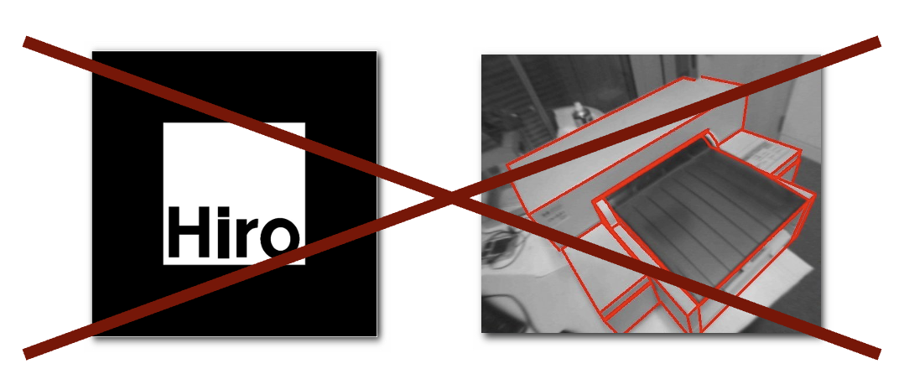
    
- Challenges:
    - Speed
    - Accuracy
    - Robustness
    - Interaction with real world

## Model-based tracking vs SLAM

---

- Model-based tracking is
    - More robust
    - More accurate
        
        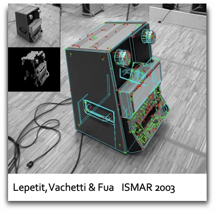
        

## Frame-by-frame SLAM

---

- Updating entire map every frame is expensive
- Mandates `sparse map of high-quality features`
    
    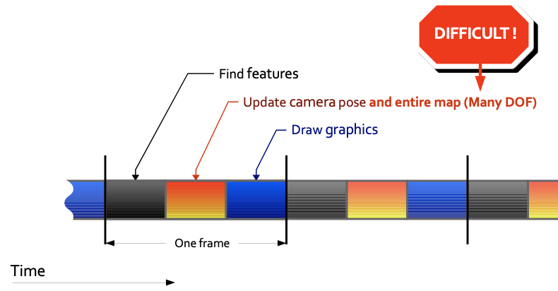
    

## Our approach

---

- Use dense map (of low-quality features)
- Don't update the map every frame: `Keyframes`
- Split the tracking and mapping into two threads
    
    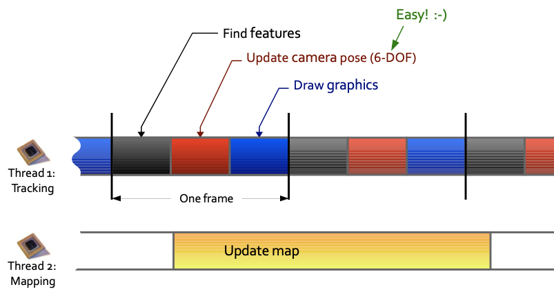
    

- **Tracking Thread** vs **Mapping Thread**
    
    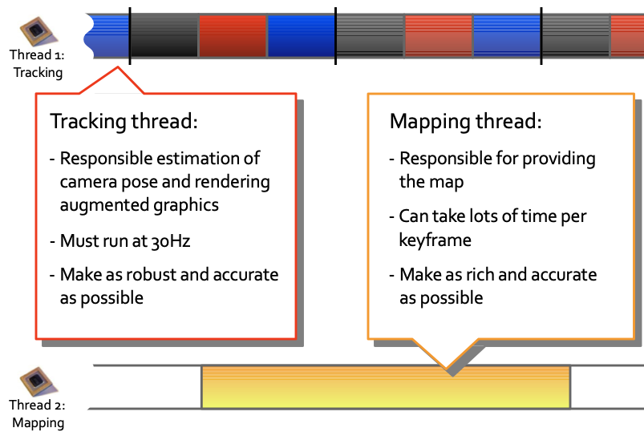
    

## Mapping Thread

---

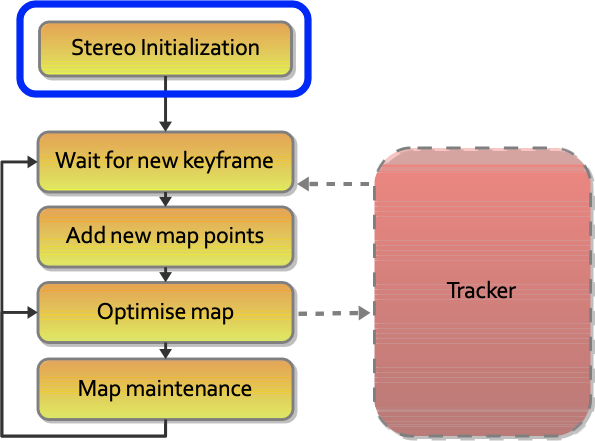

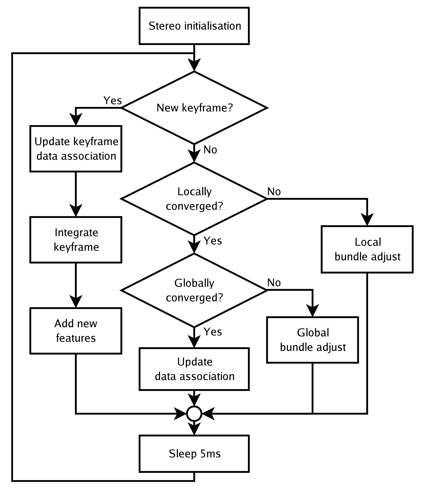

Asynchronous mapping thread

### Stereo Initialization

- Use five-point-pose algorithm (Stewenius et al '06)
- Requires a pair of frames and feature correspondences
- Provides initial map
- **User input** required:
    - Two clicks for two keyframes
    - Smooth motion for feature correspondence

### Wait for new keyframe

- Keyframes are only added if:
    - There is a baseline to the other keyframes
    - Tracking quality is good
- When a keyframe is added:
    - The mapping thread stops whatever it is doing
    - All points in the map are measured in the keyframe
    - New map points are found and added to the map

### Add new map points

- Want as many map points as possible
- Check all maximal FAST corners in the keyframe:
    - Check Shi-Tomasi score (GFTT)
    - Check if already in map
- Epipolar search in a neighbouring keyframe
- Triangulate matches and add to map
- Repeat in four image pyramid levels

### Optimise map

- Use batch SFM method: `Bundle Adjustment`
- Adjusts map point positions and keyframe poses
- **Minimises reprojection error** of all points in all keyframes (or use only last N keyframes)
- Cubic complexity with keyframes, linear with map points
- Compatible with M-estimators (we use Tukey)
    
    ```cpp
    // This is the Tukey biweight loss function which aggressively
    // attempts to suppress large errors.
    class CERES_EXPORT TukeyLoss final : public ceres::LossFunction {
     public:
      explicit TukeyLoss(double a) : a_squared_(a * a) {}
      void Evaluate(double, double*) const override;
    
     private:
      const double a_squared_;
    };
    ```
    

### Map Maintenance

- When camera is not exploring, mapping thread has  idle time
    - use this to improve the map
- Data association in bundle adjustment is reversible
- Re-attempt outlier measurements
- Try to measure new map features in all old keyframes

## Tracking Thread

---

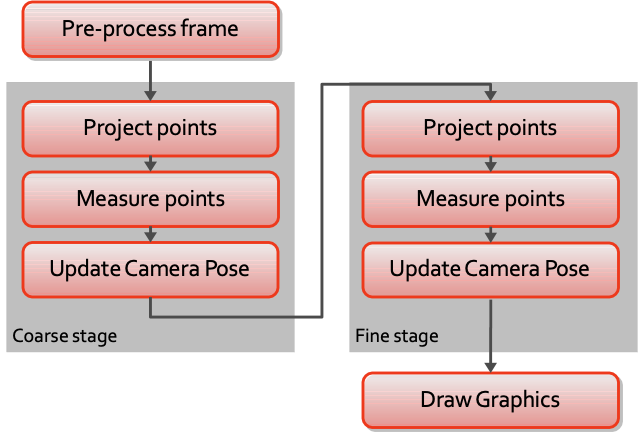

- Responsible estimation of camera pose and rendering augmented graphics
- Must run at 30Hz
- Make as robust and accurate as possible
- Track/render loop with two tracking stages

### Pre-process frame

1. Make mono and RGB version of image
    
    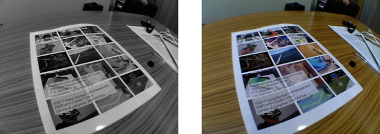
    
2. Make four pyramid levels
    
    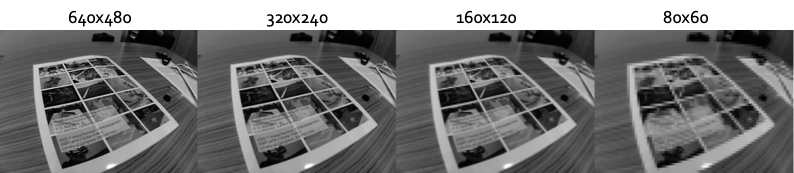
    
3. Detect FAST corners
    
    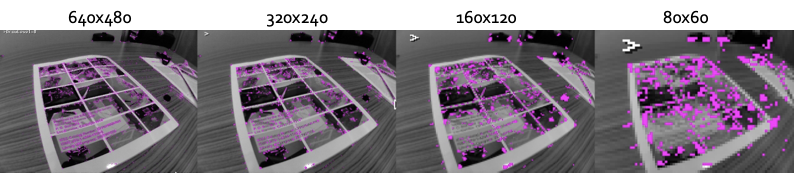
    

### Project Points

- Use motion model to update camera pose
- Project all map points into image to see which are visible, and at what pyramid level
- Choose subset to measure
    - ~50 biggest features for coarse stage (in high level image pyramid)
    - ~1000 randomly selected for fine stage

### Measure Points

- Generate 8x8 matching template (warped from source keyframe)
- Search a fixed radius around projected position
    - Use zero-mean SSD
    - Only search at FAST corner points
- Up to 10 inverse composition iterations for sub-pixel position (for some patches)
- Typically find 60-70% of patches

### Update camera pose

- 6-DOF problem
- 10 IRWLS iterations
- Tukey M-Estimator

### Draw graphics

- What can we draw in an unknown scene?
    - Assume single plane visible at start
    - Run VR simulation on the plane
- Radial distortion want proper blending

## Tracking Quality Monitoring

---

- Heuristic check based on fraction of found measurements
- Three quality levels: `Good`, `Poor`, `Lost`
    - Only add to map on `Good`
    - Stop tracking and relocalise on `Lost`

## Result

---

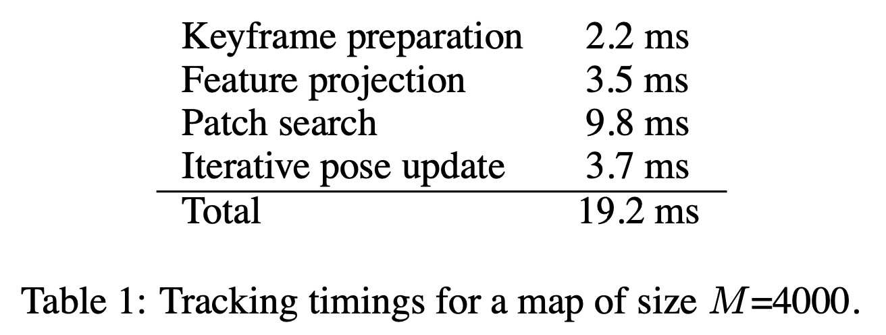

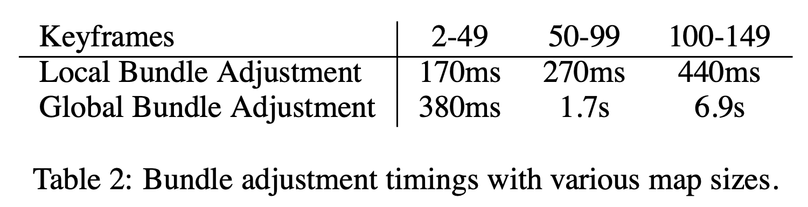