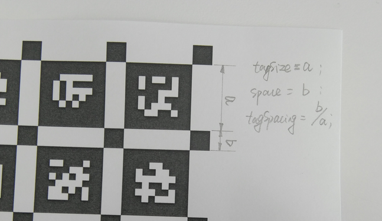

# [Step 0] Install Kalibr

1. **Install ROS1 on my system**
2. **Install the build and run dependencies**
    
    The general requirements common to all version of Ubuntu are the following:
    
    ```bash
    sudo apt-get install -y \
        git wget autoconf automake nano \
        libeigen3-dev libboost-all-dev libsuitesparse-dev \
        doxygen libopencv-dev \
        libpoco-dev libtbb-dev libblas-dev liblapack-dev libv4l-dev
    ```
    
3. **Then due to different Python versions, you will need to install the following:**
    
    ```bash
    # Ubuntu 16.04
    sudo apt-get install -y python2.7-dev python-pip python-scipy \
        python-matplotlib ipython python-wxgtk3.0 python-tk python-igraph
    # Ubuntu 18.04
    sudo apt-get install -y python3-dev python-pip python-scipy \
        python-matplotlib ipython python-wxgtk4.0 python-tk python-igraph
    # Ubuntu 20.04
    sudo apt-get install -y python3-dev python3-pip python3-scipy \
        python3-matplotlib ipython3 python3-wxgtk4.0 python3-tk python3-igraph
    ```
    
4. **Create a catkin workspace and clone the project**
    
    First we can create a workspace. It is important to configure this to build in *release mode* otherwise optimization will be slow.
    
    ```bash
    mkdir -p ~/kalibr_workspace/src
    cd ~/kalibr_workspace
    export ROS1_DISTRO=noetic # kinetic=16.04, melodic=18.04, noetic=20.04
    source /opt/ros/$ROS1_DISTRO/setup.bash
    catkin init
    catkin config --extend /opt/ros/$ROS1_DISTRO
    catkin config --merge-devel # Necessary for catkin_tools >= 0.4.
    catkin config --cmake-args -DCMAKE_BUILD_TYPE=Release
    ```
    
    We can then clone the project:
    
    ```bash
    cd ~/kalibr_workspace/src
    git clone https://github.com/ethz-asl/kalibr.git
    ```
    
5. **Build the code using the *Release* configuration. Depending on the available memory, you might need to reduce the build threads (e.g. add -j2 to catkin_make)**
    
    ```bash
    cd ~/kalibr_workspace/
    catkin build -DCMAKE_BUILD_TYPE=Release -j4
    ```
    
6. **Once the build is finished you have to source the catkin workspace setup to use Kalibr**
    
    ```bash
    source ~/kalibr_workspace/devel/setup.bash
    rosrun kalibr <command_you_want_to_run_here>
    ```
    

# [Step 1] IMU Calibration

1. **Camera setting**
    
    ```bash
    roslaunch realsense2_camera rs_camera.launch \
        unite_imu_method:="linear_interpolation" \
        enable_gyro:=true \
         enable_accel:=true
    ```
    
2. **IMU data collection**
    - Do not move the imu for about 4 hours
    
    ```bash
    rosbag record -O imu_d455_200hz_no_motion /camera/imu
    ```
    
3. **Install imu_utils**
    
    ```bash
    sudo apt-get install libdw-dev
    cd ~/kalibr_workspace/src
    git clone https://github.com/SeungRyeol/code_utils.git
    git clone https://github.com/gaowenliang/imu_utils.git
    cd ~/kalibr_workspace
    catkin build code_utils imu_utils
    ```
    
4. **d455.launch**
    
    ```xml
    <launch>
        <node pkg="imu_utils" type="imu_an" name="imu_an" output="screen">
            <param name="imu_topic" type="string" value= "/camera/imu"/>
            <param name="imu_name" type="string" value= "D455"/>
            <param name="data_save_path" type="string" value= "$(find imu_utils)/data/"/>
            <!-- recoding time (min) -->
            <param name="max_time_min" type="int" value= "420"/>
    				<!-- IMU sampling rate -->
            <param name="max_cluster" type="int" value= "200"/>
        </node>
    </launch>
    ```
    
5. **IMU calibration**
    
    ```bash
    rosbag play -r 200 imu_d455_200hz_no_motion.bag                                         ─╯
    rosbag imu_utils d455.launch
    ```
    
6. **output**: `D455_imu_param.yaml`
    - noise density (= white noise)
        - 값이 높을수록 측정한 값에 더 noise가 많이 포함됨을 의미
    - random walk
        - noise가 정규분포를 따르는지를 나타냄
        - 정해진시간 동안 얼마나 값이 자연스럽게 변하는지를 의미
        - 값이 높을수록 정규분포를 잘 따름을 의미
    
    ```yaml
    %YAML:1.0
    ---
    type: IMU
    name: D455
    Gyr:
       unit: " rad/s"
       avg-axis:
          gyr_n: 1.4407420683211966e-03 # gyro noise density
          gyr_w: 7.1670889286254780e-06 # gyro random walk
       x-axis:
          gyr_n: 1.2489656663706408e-03
          gyr_w: 4.3965318362498180e-06
       y-axis:
          gyr_n: 1.8282419173404803e-03
          gyr_w: 9.2923495672263550e-06
       z-axis:
          gyr_n: 1.2450186212524688e-03
          gyr_w: 7.8123853824002617e-06
    Acc:
       unit: " m/s^2"
       avg-axis:
          acc_n: 1.7729732858990814e-02 # acc noise density
          acc_w: 2.8594157371242095e-04 # acc random walk
       x-axis:
          acc_n: 1.8221756521889763e-02
          acc_w: 1.8221065843752827e-04
       y-axis:
          acc_n: 1.5016762911267115e-02
          acc_w: 3.2927315040658822e-04
       z-axis:
          acc_n: 1.9950679143815563e-02
          acc_w: 3.4634091229314624e-04
    ```
    
- **other methods & more information**
    
    [IMU Noise Model · ethz-asl/kalibr Wiki](https://github.com/ethz-asl/kalibr/wiki/IMU-Noise-Model#how-to-obtain-the-parameters-for-your-imu)
    

# [Step 2] Camera Calibration

1. **Prepare** **calibration board**
    
    `traget.yaml`
    
    ```yaml
    target_type: 'aprilgrid' # gridtype
    tagCols: 6               # number of apriltags
    tagRows: 6               # number of apriltags
    tagSize: 0.088           # size of apriltag, edge to edge [m]
    tagSpacing: 0.3          # ratio of space between tags to tagSize
                             # example: tagSize=2m, spacing=0.5m --> tagSpacing=0.25[-]
    ```
    

    

1. **launch camera node**
    
    `rs_camera.launch`
    
    ```xml
    <launch>
      <arg name="serial_no"           default=""/>
      <arg name="usb_port_id"         default=""/>
      <arg name="device_type"         default=""/>
      <arg name="json_file_path"      default=""/>
      <arg name="camera"              default="camera"/>
      <arg name="tf_prefix"           default="$(arg camera)"/>
      <arg name="external_manager"    default="false"/>
      <arg name="manager"             default="realsense2_camera_manager"/>
      <arg name="output"              default="screen"/>
      <arg name="respawn"              default="false"/>
    
      <arg name="fisheye_width"       default="-1"/>
      <arg name="fisheye_height"      default="-1"/>
      <arg name="enable_fisheye"      default="false"/>
    
      <arg name="depth_width"         default="-1"/>
      <arg name="depth_height"        default="-1"/>
      <arg name="enable_depth"        default="false"/>
    
      <arg name="confidence_width"    default="-1"/>
      <arg name="confidence_height"   default="-1"/>
      <arg name="enable_confidence"   default="true"/>
      <arg name="confidence_fps"      default="-1"/>
    
      <arg name="infra_width"         default="640"/>
      <arg name="infra_height"        default="480"/>
      <arg name="enable_infra"        default="true"/>
      <arg name="enable_infra1"       default="true"/>
      <arg name="enable_infra2"       default="true"/>
      <arg name="infra_rgb"           default="false"/>
    
      <arg name="color_width"         default="-1"/>
      <arg name="color_height"        default="-1"/>
      <arg name="enable_color"        default="false"/>
    
      <arg name="fisheye_fps"         default="-1"/>
      <arg name="depth_fps"           default="-1"/>
      <arg name="infra_fps"           default="30"/>
      <arg name="color_fps"           default="-1"/>
      <arg name="gyro_fps"            default="-1"/>
      <arg name="accel_fps"           default="-1"/>
      <arg name="enable_gyro"         default="true"/>
      <arg name="enable_accel"        default="true"/>
    
      <arg name="enable_pointcloud"         default="false"/>
      <arg name="pointcloud_texture_stream" default="RS2_STREAM_COLOR"/>
      <arg name="pointcloud_texture_index"  default="0"/>
      <arg name="allow_no_texture_points"   default="false"/>
      <arg name="ordered_pc"                default="false"/>
    
      <arg name="enable_sync"               default="false"/>
      <arg name="align_depth"               default="false"/>
    
      <arg name="publish_tf"                default="true"/>
      <arg name="tf_publish_rate"           default="0"/>
    
      <arg name="filters"                   default=""/>
      <arg name="clip_distance"             default="-2"/>
      <arg name="linear_accel_cov"          default="0.01"/>
      <arg name="initial_reset"             default="false"/>
      <arg name="reconnect_timeout"         default="6.0"/>
      <arg name="wait_for_device_timeout"   default="-1.0"/>
      <arg name="unite_imu_method"          default="linear_interpolation"/>
      <arg name="topic_odom_in"             default="odom_in"/>
      <arg name="calib_odom_file"           default=""/>
      <arg name="publish_odom_tf"           default="true"/>
    
      <arg name="stereo_module/exposure/1"  default="7500"/>
      <arg name="stereo_module/gain/1"      default="16"/>
      <arg name="stereo_module/exposure/2"  default="1"/>
      <arg name="stereo_module/gain/2"      default="16"/>
    
      <group ns="$(arg camera)">
        <include file="$(find realsense2_camera)/launch/includes/nodelet.launch.xml">
          <arg name="tf_prefix"                value="$(arg tf_prefix)"/>
          <arg name="external_manager"         value="$(arg external_manager)"/>
          <arg name="manager"                  value="$(arg manager)"/>
          <arg name="output"                   value="$(arg output)"/>
          <arg name="respawn"                  value="$(arg respawn)"/>
          <arg name="serial_no"                value="$(arg serial_no)"/>
          <arg name="usb_port_id"              value="$(arg usb_port_id)"/>
          <arg name="device_type"              value="$(arg device_type)"/>
          <arg name="json_file_path"           value="$(arg json_file_path)"/>
    
          <arg name="enable_pointcloud"        value="$(arg enable_pointcloud)"/>
          <arg name="pointcloud_texture_stream" value="$(arg pointcloud_texture_stream)"/>
          <arg name="pointcloud_texture_index"  value="$(arg pointcloud_texture_index)"/>
          <arg name="enable_sync"              value="$(arg enable_sync)"/>
          <arg name="align_depth"              value="$(arg align_depth)"/>
    
          <arg name="fisheye_width"            value="$(arg fisheye_width)"/>
          <arg name="fisheye_height"           value="$(arg fisheye_height)"/>
          <arg name="enable_fisheye"           value="$(arg enable_fisheye)"/>
    
          <arg name="depth_width"              value="$(arg depth_width)"/>
          <arg name="depth_height"             value="$(arg depth_height)"/>
          <arg name="enable_depth"             value="$(arg enable_depth)"/>
    
          <arg name="confidence_width"         value="$(arg confidence_width)"/>
          <arg name="confidence_height"        value="$(arg confidence_height)"/>
          <arg name="enable_confidence"        value="$(arg enable_confidence)"/>
          <arg name="confidence_fps"           value="$(arg confidence_fps)"/>
    
          <arg name="color_width"              value="$(arg color_width)"/>
          <arg name="color_height"             value="$(arg color_height)"/>
          <arg name="enable_color"             value="$(arg enable_color)"/>
    
          <arg name="infra_width"              value="$(arg infra_width)"/>
          <arg name="infra_height"             value="$(arg infra_height)"/>
          <arg name="enable_infra"             value="$(arg enable_infra)"/>
          <arg name="enable_infra1"            value="$(arg enable_infra1)"/>
          <arg name="enable_infra2"            value="$(arg enable_infra2)"/>
          <arg name="infra_rgb"                value="$(arg infra_rgb)"/>
    
          <arg name="fisheye_fps"              value="$(arg fisheye_fps)"/>
          <arg name="depth_fps"                value="$(arg depth_fps)"/>
          <arg name="infra_fps"                value="$(arg infra_fps)"/>
          <arg name="color_fps"                value="$(arg color_fps)"/>
          <arg name="gyro_fps"                 value="$(arg gyro_fps)"/>
          <arg name="accel_fps"                value="$(arg accel_fps)"/>
          <arg name="enable_gyro"              value="$(arg enable_gyro)"/>
          <arg name="enable_accel"             value="$(arg enable_accel)"/>
    
          <arg name="publish_tf"               value="$(arg publish_tf)"/>
          <arg name="tf_publish_rate"          value="$(arg tf_publish_rate)"/>
    
          <arg name="filters"                  value="$(arg filters)"/>
          <arg name="clip_distance"            value="$(arg clip_distance)"/>
          <arg name="linear_accel_cov"         value="$(arg linear_accel_cov)"/>
          <arg name="initial_reset"            value="$(arg initial_reset)"/>
          <arg name="reconnect_timeout"        value="$(arg reconnect_timeout)"/>
          <arg name="wait_for_device_timeout"  value="$(arg wait_for_device_timeout)"/>
          <arg name="unite_imu_method"         value="$(arg unite_imu_method)"/>
          <arg name="topic_odom_in"            value="$(arg topic_odom_in)"/>
          <arg name="calib_odom_file"          value="$(arg calib_odom_file)"/>
          <arg name="publish_odom_tf"          value="$(arg publish_odom_tf)"/>
          <arg name="stereo_module/exposure/1" value="$(arg stereo_module/exposure/1)"/>
          <arg name="stereo_module/gain/1"     value="$(arg stereo_module/gain/1)"/>
          <arg name="stereo_module/exposure/2" value="$(arg stereo_module/exposure/2)"/>
          <arg name="stereo_module/gain/2"     value="$(arg stereo_module/gain/2)"/>
    
          <arg name="allow_no_texture_points"  value="$(arg allow_no_texture_points)"/>
          <arg name="ordered_pc"               value="$(arg ordered_pc)"/>
          
        </include>
      </group>
    </launch>
    ```
    
2. **Record stereo camera data**
    1. launch camera node
        
        ```bash
        roslaunch realsense2_camera rs_camera.launch
        rqt_image_view
        ```
        
    2. The recommended rate for camera calibration is about `4 frames per second` (FPS=4)
        
        ⇒ Need to "convert" the sensor's Topic transmission rate
        
        ```bash
        rosrun topic_tools throttle messages /camera/infra1/image_rect_raw 4.0 /infra1_image_rect_raw
        rosrun topic_tools throttle messages /camera/infra2/image_rect_raw 4.0 /infra2_image_rect_raw
        ```
        
    3. record
        - rotate around the camera's three axes three times (r, p, y)
        - then move along the camera's three axes three times (x, y, z)
        
        ```bash
        rosbag record -O stereo_d455_4hz /infra1_image_rect_raw /infra2_image_rect_raw
        ```
        
        
        
3. **Calibration using Kalibr**
    - troubleshooting option:  `--approx-sync 0.1`
    
    ```bash
    rosrun kalibr kalibr_calibrate_cameras --target target.yaml --bag stereo_d455_4hz.bag --models pinhole-radtan pinhole-radtan --topics /infra1_image_rect_raw /infra2_image_rect_raw --show-extraction --approx-sync 0.1
    ```
    

# [Step 3] Camera-IMU Calibration

1. **Record Camera-IMU data**
    1. launch camera node
        
        ```bash
        roslaunch realsense2_camera rs_camera.launch
        rqt_image_view
        ```
        
    2. Rate for camera-imu calibration
        - `Camera 20FPS` / `IMU 200FPS` (recommanded)
        
        ```bash
        rosrun topic_tools throttle messages /camera/infra1/image_rect_raw 20.0 /infra1_image_rect_raw
        rosrun topic_tools throttle messages /camera/infra2/image_rect_raw 20.0 /infra2_image_rect_raw
        rosrun topic_tools throttle messages /camera/imu 200.0 /imu
        ```
        
    3. Record
        - rotate around the camera's three axes three times (r, p, y)
        - then move along the camera's three axes three times (x, y, z)
        
        ```bash
        rosbag record -O stereo_imu_d455_4_200hz /infra1_image_rect_raw /infra2_image_rect_raw /imu
        ```
        
2. **Edit IMU calibration file**
    - `stereo_imu_d455_4_200hz-imu.yaml` from **[Step1]**
        
        ```yaml
        %YAML:1.0 # need to specify the file type at the top!
        imu0:
          T_i_b:
            - [1.0, 0.0, 0.0, 0.0]
            - [0.0, 1.0, 0.0, 0.0]
            - [0.0, 0.0, 1.0, 0.0]
            - [0.0, 0.0, 0.0, 1.0]
          accelerometer_noise_density: 0.017729732858990814
          accelerometer_random_walk: 0.00028594157371242095
          gyroscope_noise_density: 0.0014407420683211966
          gyroscope_random_walk: 7.167088928625478e-06
          model: calibrated
          rostopic: /camera/imu
          time_offset: 0.0
          update_rate: 200.0
        ```
        
3. **Camera-IMU Calibration using Kalibr**
    
    ```bash
    rosrun kalibr kalibr_calibrate_imu_camera --target target.yaml --cam stereo_d455_4hz-camchain.yaml --imu imu_d455_200hz.yaml --bag stereo_imu_d455_4_200hz.bag --show-extraction
    ```
    
4. **Output**
    - `stereo_imu_d455_4_200hz-camchain-imucam.yaml`
        
        ```yaml
        %YAML:1.0 # need to specify the file type at the top!
        cam0:
          T_cam_imu:
            - [0.9999973593015088, -0.0022550796830233914, -0.000442725231875276, -0.012916081825881628]
            - [0.0022563250684470874, 0.9999934416855903, 0.002832945991714477, 0.007462370070776795]
            - [0.00043633380939499077, -0.002833937442797387, 0.9999958891972386, -0.11191163786044368]
            - [0.0, 0.0, 0.0, 1.0]
          cam_overlaps: [1]
          camera_model: pinhole
          distortion_coeffs: [-0.0007119528454630575, -0.006285769884143065, 0.0010173454928125662, 0.000439277311141786]
          distortion_model: radtan
          intrinsics: [384.4178744540445, 386.1281511732971, 324.5215073930531, 238.3646256882021]
          resolution: [640, 480]
          rostopic: /camera/infra1/image_rect_raw
          timeshift_cam_imu: -0.00882385396887695
        cam1:
          T_cam_imu:
            - [0.9999886691417492, -0.0034283133922300385, -0.0033027648111881715, -0.09715882258430064]
            - [0.003467034940692787, 0.9999244793085994, 0.011790477010984962, 0.004158589263432535]
            - [0.0032620939338685565, -0.011801794215762522, 0.9999250353883813, -0.12958280935977812]
            - [0.0, 0.0, 0.0, 1.0]
          T_cn_cnm1:
            - [0.999995221810373, -0.0011813479602587776, -0.002856706743127131, -0.08455368554875571]
            - [0.0012068964657836736, 0.9999591460319156, 0.008958217905340154, -0.002285358728310769]
            - [0.002846007262870998, -0.00896162285054836, 0.9999557938021765, -0.017572484478506453]
            - [0.0, 0.0, 0.0, 1.0]
          cam_overlaps: [0]
          camera_model: pinhole
          distortion_coeffs: [-0.005420475160134567, -0.001793591486637579, -0.0022172875681656357, 0.00211699449573441]
          distortion_model: radtan
          intrinsics: [375.3864738193805, 376.3217143297171, 321.3395908712707, 235.57039591940472]
          resolution: [640, 480]
          rostopic: /camera/infra2/image_rect_raw
          timeshift_cam_imu: -0.008742585877256124
        ```
        

# References

Please cite the appropriate papers when using this library or parts of it in an academic publication.

1. L. Oth, P. Furgale, L. Kneip, R. Siegwart (2013). Rolling Shutter Camera Calibration, In Proc. of the IEEE Computer Vision and Pattern Recognition (CVPR)
2. J. Maye, P. Furgale, R. Siegwart (2013). Self-supervised Calibration for Robotic Systems, In Proc. of the IEEE Intelligent Vehicles Symposium (IVS)
3. Paul Furgale, T D Barfoot, G Sibley (2012). Continuous-Time Batch Estimation Using Temporal Basis Functions. In Proceedings of the IEEE International Conference on Robotics and Automation (ICRA), pp. 2088–2095, St. Paul, MN.
4. Paul Furgale, Joern Rehder, Roland Siegwart (2013). Unified Temporal and Spatial Calibration for Multi-Sensor Systems. In Proceedings of the IEEE/RSJ International Conference on Intelligent Robots and Systems (IROS), Tokyo, Japan.
5. Joern Rehder, Janosch Nikolic, Thomas Schneider, Timo Hinzmann, Roland Siegwart (2016). Extending kalibr: Calibrating the extrinsics of multiple IMUs and of individual axes. In Proceedings of the IEEE International Conference on Robotics and Automation (ICRA), pp. 4304-4311, Stockholm, Sweden.