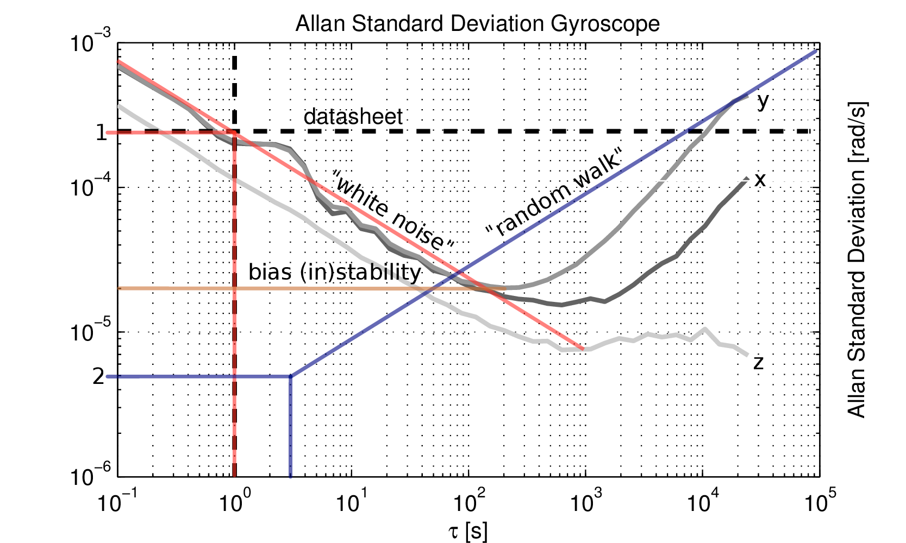

# **The IMU Noise Model**

- Kalibr에 사용된 IMU 측정 모델에는 **두 가지 유형의 센서 오류**가 포함되어 있음
    - `White Noise` $n$
        - 매우 빠르게 변동하는 noise
    - `Bias` $b$
        - 천천히 변동하는 센서 bias
    - 예를 들어, 각도에 대한 rate measurement인 $\tilde{\omega}$는 아래와 같이 표현 가능
        - $\tilde{\omega}(t)=\omega(t)+b(t)+n(t) .$
        - 세 개의 센서 축 모두를 모델링하기 위해 동일한 모델이 독립적으로 사용됨
        - 위 모델은 가속도계 측정 오류를 모델링하는 데에도 사용되기도 함

## White Noise

- **continuous-time**
    - $E[n(t)] \equiv 0$
    - $E\left[n\left(t_1\right) n\left(t_2\right)\right]=\sigma_g^2 \delta\left(t_1-t_2\right)$
        - $\sigma_g$ (noise strength)
            
            ⇒ 클수록 gyro measurements의 노이즈가 심함을 의미
            
            ⇒ $\sigma_g$: `gyroscope_noise_density` in Kalibr
            
            ⇒ $\sigma_a$: `accelerometer_noise_density` in Kalibr
            
- **discrete-time**
    - $n_d[k]=\sigma_{g d} w[k]$
        - $w[k] \sim \mathcal{N}(0,1)$
        - $\sigma_{g d}=\sigma_g \frac{1}{\sqrt{\Delta t}}$
        - $\Delta t$: sampling time

## Bias

- Brownian motion process, Wiener process, Random walk 등으로 불림
- **continuous-time**
    - $\dot{b}_g(t)=\sigma_{b g} w(t)$
        - $w$: white noise
            
            ⇒ 이 값은 bias의 strength와 결합되어 bias를 결정하게 됨
            
        - $\sigma_{bg}$ (gyro bias strength), $\sigma_{ba}$ (accel bias strength)
            
            ⇒ bias의 variations이 클수록 위 파라미터를 높게 설정해야 함
            
            ⇒ $\sigma_{bg}$: `gyroscope_random_walk` in Kalibr

            ⇒ $\sigma_{ba}$: `accelerometer_random_walk` in Kalibr
            
- **discrete-time**
    - $b_d[k]=b_d[k-1]+\sigma_{b g d} w[k]$
        - $w[k] \sim \mathcal{N}(0,1)$
        - $\sigma_{b g d}=\sigma_{b g} \sqrt{\Delta t}$
        

## The Noise Model Parameters in Kalibr

- **White Noise Model**
    
    $\begin{aligned}& E[\mathbf{n}(t)] \equiv \mathbf{0}_{3 \times 1} \\& E\left[\mathbf{n}\left(t_1\right) \mathbf{n}^T\left(t_2\right)\right]=\sigma_g^2 \mathbf{I}_{3 \times 3} \delta\left(t_1-t_2\right)\end{aligned}$
    

| Parameter | Kalibr element | Symbol | Units |
| --- | --- | --- | --- |
| Gyroscope "white noise" | `gyroscope_noise_density` | $\sigma_{g}$ | $\frac{\mathrm{rad}}{s} \frac{1}{\sqrt{H z}}$ |
| Accelerometer "white noise" | `accelerometer_noise_density` | $\sigma_{a}$ | $\frac{\mathrm{m}}{s^2} \frac{1}{\sqrt{H z}}$ |
| Gyroscope "random walk" | `gyroscope_random_walk` | $\sigma_{bg}$ | $\frac{\mathrm{rad}}{s^2} \frac{1}{\sqrt{H z}}$ |
| Accelerometer "random walk" | `accelerometer_random_walk` | $\sigma_{ba}$ | $\frac{\mathrm{m}}{s^3} \frac{1}{\sqrt{H z}}$ |
| IMU sampling rate | `update_rate` | $\frac{1}{\Delta t}$ | $H z$ |

# **How to Obtain the Parameters for your IMU**

## **From the Datasheet of the IMU**

- Check the Datesheet of the IMU

## **From the Allan standard deviation (AD)**

- The useful open source tool for computing IMU parameters using **Allan Deviation**
    - [https://github.com/ori-drs/allan_variance_ros](https://github.com/ori-drs/allan_variance_ros)
    - [https://github.com/gaowenliang/imu_utils](https://github.com/gaowenliang/imu_utils)
    - [https://github.com/rpng/kalibr_allan](https://github.com/rpng/kalibr_allan)
    - [https://github.com/AlbertoJaenal/imu_still_calibration](https://github.com/AlbertoJaenal/imu_still_calibration)
    - [https://github.com/Kyle-ak/imu_tk](https://github.com/Kyle-ak/imu_tk)
    - [https://github.com/GAVLab/allan_variance](https://github.com/GAVLab/allan_variance)
- Allan standard deviation of a MEMS gyro with manually identified noise processes
    